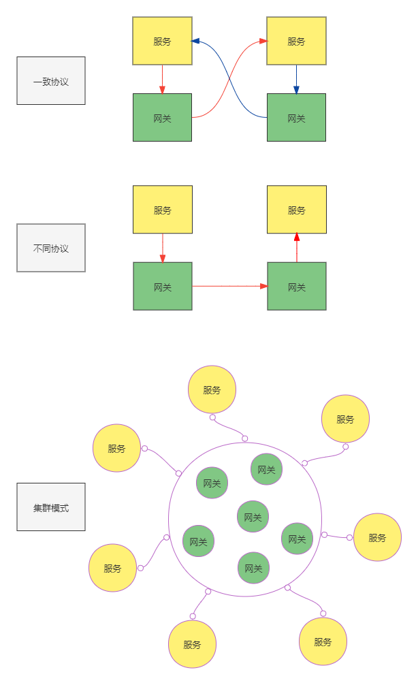

# MRNG 基于Openresty的微服务网关

## 说明
> 网关：指 `Openresty` 组成的集群  
> 节点：指服务运行的后端实体，通常以 `ip:port` 形式标识   
> 服务：归纳的业务服务名称，例如 api / order / user ......

### 核心目标
+ 将 Nginx 的后端负载均衡动态化
+ 简单可依赖

### 实现细节
+ 借助 `Openresty`，使用 `Lua` 脚本编写  
+ 在 nginx 中的 `upstream` 配置动态选择服务节点
+ 默认服务以url路径标识，如 http://xxx.com/api ，服务名称解析为 api
+ 采用加权轮询的均衡策略
+ 支持服务降级、熔断
+ 支持本地文件配置的简单模式
+ 管理端实时推送到共享内存，Nginx 工作进程定时同步共享内存，默认 5 秒
+ 由于数据交互采用的是 Http 代理模式（支持fastCGI），因此数据交互推荐 json-rpc 模式

### 部署模式
> **sidecar** 模式  
> + 服务内部协议一致，如都是http   
> + 服务内部协议不同，如有的http，有的fastcgi  
> 
> **集群模式**  
> + 网关和服务独立部署  
>   
> 图示：  



### 一致喜恶意模式

## 关联工程
+ `mrng-api` 管理端的 API 实现 (golang)  
+ `mrng-ui` 管理端前端 UI 实现 (bootstrap5)

## 安装
+ 前提是已经安装好了 `Openresty`
+ 将 lua 代码包解压到 `/usr/local/mrng`

## 配置
```nginx
http {
    include       mime.types;
    default_type  application/octet-stream;

    sendfile        on;
    keepalive_timeout  65;

    # 设置lua包路径，引入工作进程初始化文件
    lua_package_path ";;/usr/local/mrng/?.lua;";
    init_worker_by_lua_file "/usr/local/mrng/work.lua";
    lua_shared_dict mrng 10m;

    # 核心处 动态负载
    upstream backend {
        server 0.0.0.1;
        balancer_by_lua_file /usr/local/mrng/main.lua;
    }

    server {
        listen 7070;
        location / {
            proxy_set_header  Host  $host;
            proxy_set_header  X-real-ip $remote_addr;
            proxy_set_header  X-Forwarded-For $proxy_add_x_forwarded_for;

            default_type 'text/html';
            proxy_pass http://backend;
        }
    }

    # 管理端口，管理端会向该端口发送配置信息
    server {
        listen 7071;
        location / {
            default_type 'text/html';
            content_by_lua_file /usr/local/mrng/api.lua;
        }
    }
}

```

## 其他选择
+ Envoy 、Kong、APISIX、Tyk 这些更成熟、功能更多、社区更活跃  
+ 但是这些项目噪音太多，通常情况下我们不需要开着车到小区门口买瓶酱油